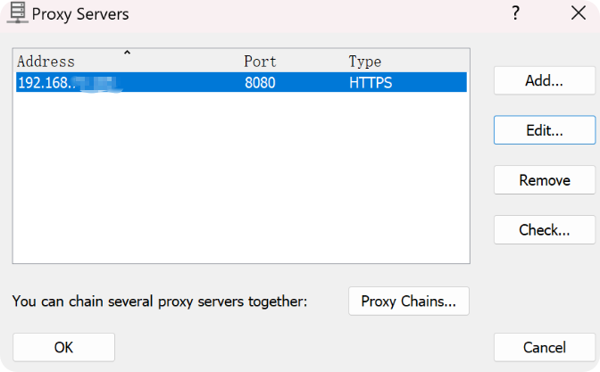
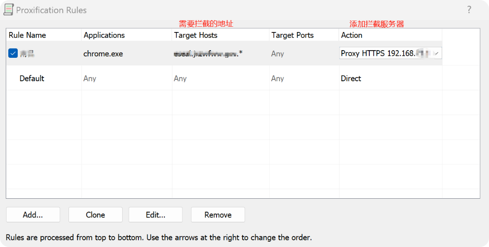

# 拦截特定请求并返回自定义响应
   -- [config.py](config.py)  配置文件
   -- [request_mocker.py](request_mocker.py)  启动文件
   
## run
```
mitmdump -s request_interceptor.py
```

## 使用proxifier代理
  1. profile -> ProxyServers 配置代理服务器
   
  2. profile -> Proxification Rules 配置拦截
   

## [安装证书和设置代理](https://blog.csdn.net/feiyu68/article/details/119665869)